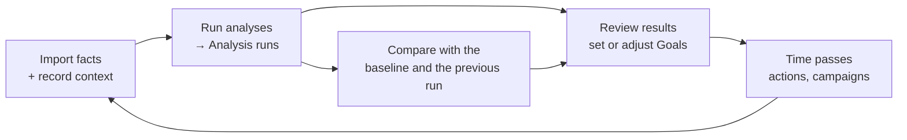
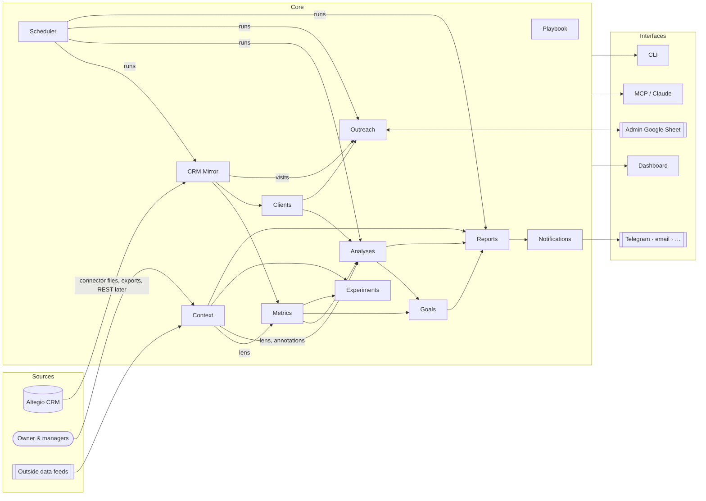

# barberis-insights — Architecture

> Living document. It describes the **target** architecture and how the current code maps onto it.
> Vocabulary lives in [`CONTEXT.md`](../CONTEXT.md). Decisions that are hard to reverse live in [`docs/adr/`](adr/).
> The roadmap and the process for changing this document are in [`PLAN.md`](PLAN.md).
> Status: **accepted 2026-10-03** after the `grill-with-docs` session. No open-question markers remain; change it with the process in §10.

## 1. Purpose

A side tool for the **owner and managers** of a barbershop. It helps them run the business: understand performance, keep clients coming back, set and track goals, and decide what to change.

It works **next to** the CRM (Altegio), not instead of it. Staff keep working in Altegio; this tool reads from it, adds knowledge Altegio doesn't have, and turns both into decisions.

**The client is the main priority.** Most analysis questions come back to whether clients come, return, and stay.

## 2. Two sources of truth

| | **Facts** | **Context** |
|---|---|---|
| What | What happened: appointments, visits, schedules, clients, services, prices | Why it may have happened, and what was going on: decisions, outside events, beliefs about cause and effect |
| Source | Altegio CRM | The owner and managers; later, automated outside data feeds |
| Who may change it | Nobody locally. Altegio is the source of truth; the local copy is a mirror. | The owner and managers (and Claude on their behalf) |
| Examples | 42 visits for a barber in a week | A planned power outage cut Tuesday short. Prices rose on 19 March. Many regular clients are abroad in summer. A competitor opened nearby. |

Facts without Context lead to wrong conclusions. For example:
- a drop caused by power outages gets read as falling demand
- a price rise gets credit for a change that seasonality caused

So **every analysis declares which Context it took into account**, and Context can change the result in defined ways (§5.5).

The owner's beliefs are valuable but can be wrong. Each one can be turned into a **Hypothesis** and checked against the Facts. Context is respected, not blindly trusted.

## 3. The analysis cycle

The tool exists to run this loop, over and over, with code instead of ad-hoc chat analysis:



1. **Run:** every analysis runs on the data available, for a window, a scope and a lens. Each result is stored as an **Analysis run**, which is reproducible and versioned.
2. **Baseline:** the first run a goal is set against is its **Baseline**. The analysis of 27 September 2026 is the first baseline: stored 2026-10-04 as one run of each analysis over 2026-01-12 – 2026-09-27 (runs 28–37), except retention and return cohorts, which use 2026-01-12 – 2026-06-28, the latest window whose 90-day follow-up has happened (runs 38–39). By convention a run whose window ends on `baseline_date` is a baseline run.
3. **Goals** are set on metrics that the analyses report.
4. **Compare:** a later run of the same analysis, scope and lens is **compared** with the baseline and with the previous run. The comparison says, metric by metric, whether things moved toward the goals, and Context explains why.

The two analyses first built by hand in chat — the per-barber weekly book and the team comparison — become the first analyses in code (§5.3), and their pages become the Barber and Team pages, computed from the data (§6.4).

## 4. Principles

1. **Altegio is authoritative for facts.** Local data is a re-importable mirror. Local-only data (goals, factors, cases, analysis runs, notes) is the only thing that must be backed up.
2. **Context is first-class data**, with dates, scope and declared effects, not free text attached to charts.
3. **Analyses are code, and their results are data** (ADR-0007). One module per metric, and one module per analysis. Runs are stored and compared; nothing important lives only in a chat answer.
4. **Every number is reproducible.** A run or measurement records its window, the versions of its metric and analysis definitions, its lens, and a fingerprint of the data it saw.
5. **Modules own their data.** A module changes its own tables only. Others go through its service interface.
   New modules (Analyses, Scheduler, Notifications) expose a service interface from their first commit.
   The graph is acyclic: Context and Mirror depend on nobody, and Context never calls Experiments (a Factor's verdict is read from its linked Hypotheses).
6. **Pure domain logic, thin edges.** Metrics and analyses are pure functions over loaded data, testable with fixtures. I/O (database, Altegio files, Google, web) sits at the edges.
7. **Local-first and private.** It runs on the owner's laptop. Personal data stays in `var/` and never goes to git. Only the data the admin needs reaches their sheet.
8. **Portable to a server later.** Hosting is not a goal now (ADR-0003), but nothing may rule it out:
   - Scheduler and Notifications get time and storage through service interfaces; launchd is only one trigger of `insights jobs tick`.
   - No module reads a fixed laptop path; everything comes from `INSIGHTS_*` config.
   - Authentication and multiple users are out of scope. A hosted version needs its own ADR.
9. **Claude is a first-class user.** Every capability a person has in the dashboard is also exposed through the MCP server, with the same rules. Claude writes the narrative on top of stored runs, never instead of them.
10. **Extensible by registration.** New metrics, analyses, data sources, factor feeds plug in without changing existing modules.

## 5. Module map



Dependencies point **one way**, from left to right. Mirror and Context depend on nobody. Interfaces depend on modules and never the reverse. The Scheduler sits on top: it only calls other modules' services, and nothing calls it.

| Module | Responsibility | Owns (tables) | Depends on | Code today |
|---|---|---|---|---|
| **CRM Mirror** | Import and keep a faithful local copy of Altegio facts; record every sync run | `barbers`, `appointments`, `appointment_services`, `schedule_slots`, `clients` (Altegio fields, including the description and the Do-not-contact tag), `sync_runs` | — | `ingest/`, `db/` |
| **Context** | The owner's truth: factors (outside and internal), decisions, observations, and how each should affect analysis | `notes` (→ `factors`, §5.5) | — | `context/` |
| **Metrics** | One module per metric: its definition, scopes, direction and version; measurements | `measurements` | Mirror, Context | `metrics/` (all in `core.py` today) |
| **Analyses** | One module per analysis: a structured, versioned result for a window, scope and lens; stored runs; comparisons between runs | `analysis_runs` | Metrics, Clients, Context | not yet (logic lives in `legacy/`, `metrics/weekly.py`, `web/app.py`) |
| **Clients** | Client profiles, segments, value, risk | `client_profiles` | Mirror, Context | `clients/` |
| **Outreach** | Win-back cases, offers, the admin sheet, attribution of returns, write-back of tagged lines to Altegio (ADR-0010) | `outreach_cases`, `outreach_events`, `offers` | Clients, Mirror (visits) | `outreach/` |
| **Goals** | Goals on metrics, with baseline, target, due date, and progress from measurements and runs | `goals`, `goal_events` | Metrics, Analyses | `goals/` |
| **Experiments** | Hypotheses (each linked to a Factor) and their evaluation (difference-in-differences, before/after, offer A/B), controlling for Context | `hypotheses` | Metrics, Context, Outreach | `experiments/` |
| **Playbook** | Shared routines and tips for barbers | `tips` | — | `playbook/` |
| **Scheduler** | Run jobs on a daily, weekly or monthly cadence; catch up runs missed while the laptop was asleep; record every run | `jobs`, `job_runs` | the services of the modules it runs | not yet |
| **Notifications** | Deliver the weekly review and alerts to people through channels (Telegram first), in each recipient's language; record every delivery | `recipients`, `subscriptions`, `deliveries` | Analyses, Goals | not yet (the website already sends Telegram messages for call-back requests) |
| **Interfaces** | Dashboard, JSON API, CLI, MCP server | — | all modules (through services) | `web/`, `api/`, `cli.py`, `mcp_server.py` |

**Planned:**
- **Finance:** product sales, costs and payroll, once Altegio data allows.
- **Feeds:** adapters that create factors automatically (§5.5).

## 6. Modules in detail

### 6.1 CRM Mirror
- **Adapters** implement one contract: *give me canonical rows for a window* (`ingest/base.py`: `upsert_appointments`, `replace_schedule`, `sync_run`).
  - **Today:** files saved from the Altegio Pro connector (`connector_files.py`) and the Altegio client export, matched to client IDs by visit time (`client_export.py`, `client_match.py`).
  - **Later:** an Altegio REST adapter, once the partner token works (ADR-0002).
- **Rules:**
  - Idempotent upserts keyed by Altegio IDs; the newest copy wins.
  - Each import is a `sync_run` with counts and a log.
  - Nothing outside Mirror writes to Altegio-owned fields.
- **Known data gaps** are recorded as Context observations, not patched in code:
  - cancelled appointments are deleted in Altegio
  - no-show marking is manual
  - service payments are not recorded
  - shifts of team members deleted in Altegio (four former barbers, one with 1,715 appointments through April 2025) cannot be fetched (HTTP 404), so shop-level capacity before mid-2025 is understated

### 6.2 Metrics — one module per metric
- **Layout:**
  ```
  metrics/
    registry.py          MetricDef (key, label, unit, direction, scopes, version) and @metric
    context.py           Dataset and WindowContext: loaded facts, schedules and history for one window
    capacity/            busy_share.py (util), busy_share_by_weekday.py (util_d0..d6)
    revenue/             revenue_per_hour.py (rph), average_check.py (check)
    volume/              visits_per_week.py (visits_wk)
    clients/             new_to_shop.py (new_share), return_90d.py (conv_new90), overdue_regulars.py (risk_n)
    channels/            online_share.py (online), addon_share.py (addon)
  ```
  Metric keys are stable; module names describe the metric. New modules are discovered at start-up.
  ```
- **Each metric module holds:**
  - one `@metric` definition: a pure function `(WindowContext, Scope) → value`
  - a docstring with the business definition
  - a `VERSION`
  - a fixture test in `tests/metrics/`
- **Scopes:** barber, team, shop, and later segment.
- **Measurements** are a projection of runs, written only as a side effect of a run or a manual snapshot (itself a run). Stored in long format (`asof`, window, scope, metric, metric version, lens, value), so a new metric needs no schema change.
- **Changing a definition** raises the metric's `VERSION`, and comparisons only compare equal versions. Measurements and Goals store the version (`metric_version`); a Goal whose metric has moved on shows "definition changed" until its baseline and target are re-set. Example: `risk_n` is at version 2 since 2026-10-04 (the 180-day Lapsed cap that the glossary always had); the baseline window holds both versions. A re-run of an old window under the new version creates a new run, and the Goal's Baseline is re-pointed to it with an audit event; this is a person's decision, not automatic. The bump command lists the Goals and Baselines affected. It only works while the Mirror still holds the data, so the data fingerprint flags windows that can no longer be reproduced.
- **History:** the Mirror holds appointments from 2022-01-03. Client profiles, segments and win-back read all of it (`history_start`). The existing Goal metrics keep reading from 2025-01-01 (`metrics_history_start`) until each is re-versioned in the Metrics split; widening it silently would move `risk_n` (73 → 194 for one barber) and `conv_new90`, which active Goals use. Per-barber output covers only currently employed barbers; shop-level analytics use every barber's appointments.
- **Windows** are whole ISO weeks. Date-range Windows (such as the owner's 15th–14th month) are deferred until needed.
- **Regression:** the 2026-09-27 baseline is pinned by `tests/test_metrics_baseline.py`.

### 6.3 Analyses — one module per analysis
An **analysis** answers one business question for a window, scope and lens, with a structured result. It calls metrics and Clients; it never queries tables directly.

- **Contract** for each analysis module:
  ```python
  class Analysis(Protocol):
      key: str; version: int; scopes: set[str]
      def run(self, ctx: AnalysisContext) -> AnalysisResult: ...
      def compare(self, before: AnalysisResult, after: AnalysisResult) -> Comparison: ...
  ```
- **`AnalysisResult`** is plain JSON:
  - `kpis`: metric key → value
  - `series`: named time series
  - `tables`: named rows
  - `findings`: rule-based, each with severity and the evidence behind it
  - `context`: the factors in force during the window
- **The first analyses**, taken from the hand-built pages and earlier chat analyses:

| Analysis | Question it answers | Origin |
|---|---|---|
| `barber_scorecard` | How does each barber do on the key metrics, against last year and against the team? | team comparison scorecard |
| `weekly_book` | Week by week: revenue against last year, busy share, clients by type, ledger | Оля's weekly book |
| `weekday_pattern` | Which days and hours are full or empty, per barber? | weekday heat table, hour histogram |
| `price_demand` | Did price changes reduce visits per work day? | price vs demand chart |
| `client_retention` | Of last period's clients, how many stayed, switched to another barber, or were lost? | "where clients went" |
| `return_cohorts` | Of first-time clients by month, how many came back? | second-visit cohort table |
| `client_sources` | Where did a barber's clients come from (returning, other barbers, new to the shop)? | client sources table |
| `exclusive_clients` | How many regulars see only this barber (risk if they leave)? | exclusivity analysis |
| `departure_impact` | When a barber left, how many of their regulars stayed with the shop, and with whom? | Віталій analysis |
| `new_clients` | How many new clients per day and month, and what share of all clients? | new-clients analysis |
| `service_mix` | Which services and extras drive revenue? | service mix |
| `seasonality` | How do visits and revenue per work day in recurring periods (summer, holidays and their run-up) differ from each year's own average? Gives recurring Factors their effect | multi-year history |
| `overdue_regulars` | Who is overdue, and how much are they worth? | at-risk analysis |

- **Analysis run** (`analysis_runs` table): analysis key and version, scope, window, lens, `asof`, data fingerprint (appointment count and last import), created by (person, schedule or Claude), and the result JSON. Runs are immutable; re-running creates a new run.
- **Built:** all twelve (2026-10-04): `barber_scorecard`, `client_retention` (stayed / switched / lost within a 90-day follow-up), `overdue_regulars`, `weekly_book`, `weekday_pattern`, `service_mix`, `new_clients`, `client_sources`, `return_cohorts`, `exclusive_clients`, `departure_impact` (the one analysis about a former barber, by `barber` key), `price_demand` (each price change set against the other barbers over the same weeks), and `seasonality` (the effect source for recurring Factors; the current year is measured against the trailing 52 weeks). Client typing reads all loaded history, so a run near 2022-01-03 carries a `history_too_short` note. Windows are whole ISO weeks; scope is `team` (with a per-barber breakdown) or one current barber; former barbers never appear. Rows hold client ids only. A scorecard run stores its metric values as a measurement when asked (`insights snapshot`), so there is one write path.
- **Comparison:** `compare(before, after)` gives each KPI's change and whether it is better or worse (using the metric's direction), plus what is new or resolved among the findings. Runs are only comparable when the analysis version, metric versions, scope and lens match; otherwise the comparison says why not.

### 6.4 No stored reports
There is no "report" concept (decided 2026-10-06, ADR-0011). Everything the dashboard shows is computed from the Mirror (the CRM data stored locally) and from the stored analysis runs, goals and Context; the Barber, Team, Explore and Overview pages are live views of those facts. The weekly message to the owner is built from the data at the moment it is sent, and the record of what went out is the delivery row and the job's own run record. A monthly review stays deferred; when built it is a page or a message, not a stored report. Its Window is the last 4 or 5 complete ISO weeks, ending in the week that contains the 14th; its label shows the real dates. Goal due dates snap to the end of a week.

### 6.5 Context — the second source of truth
This module turns the owner's knowledge into data the analysis can act on.

**Factor** (target model; today's `notes` are its narrative-only predecessor):

| Field | Meaning |
|---|---|
| `kind` | `external` (not under our control: migration and mobilisation, holidays and the run-up to them, security, competition; others by hand) or `internal` (our decision: price, staff, schedule, marketing, operations) |
| `period` | dates when it applies, at day or week grain (no hours). Can recur yearly (summer, holidays and the run-up to them); the effect of a recurring factor is measured by the `seasonality` analysis from the shop's own history and linked to the factor; it is never typed in, and a factor with fewer than 2 observed years shows "not enough history" |
| `scope` | shop, team, specific barbers, or one client (`client:<id>`). Segment scopes are not supported yet |
| `expected_effects` | the owner's belief: which metrics and which direction (required), an optional size range. No confidence value |
| `treatment` | how analysis should handle it, see the table below |
| `source` | owner, manager, Claude, or a named feed |
| `status` | `belief` → `supported` / `refuted` / `inconclusive`. Derived on read from the linked Hypotheses; never stored on the Factor |

**Treatments: how Context changes analysis**

| Treatment | Effect on analysis | Example |
|---|---|---|
| `annotate` | Shown on charts, timelines and reports; numbers unchanged | Competitor opened nearby |
| `exclude` | The period is removed from comparisons and baselines for that scope | Shop closed for several days |
| `adjust` | The denominator or expectation is corrected (e.g. scheduled hours reduced for a day the shop opened late) | The shop opened late on a work day |
| `suppress_overdue` | Client scope only: the client is not Overdue and not proposed for win-back until the factor ends | A client abroad until June |
| `control` | Used as a covariate or a matching condition in Experiments | Season, holidays and the run-up to them |

**Default Lens:** one per shop, `raw` at first, set in config. Each Goal records the Lens it was set under and is judged only under it. Reports may show a second Lens beside the default, but the headline number always uses the default. Changing the default is an audit event and a person's decision.

**Lens:** a named rule (selectors plus a treatment), for example "raw", "clean weeks" or "outage-adjusted". It is resolved at run time to a frozen list of factor IDs and versions, and the run stores that list, not only the name. Two runs with the same Lens name but different resolved Factors are not comparable, and the comparison says why.

**Feeds** *(planned):* adapters that create external factors automatically. Candidates:
- public holidays and the run-up to them
- migration and mobilisation (a proxy may be needed)
- air-raid alert history for Lviv (low priority: rare impact)
- Not worth tracking: power outages (reserve power), weather (too fine-grained), the economy (too wide)

Each feed is a plugin, like a Mirror adapter. Settled by the research of 2026-10-04 (`docs/research/external-factor-feeds.md`): no live feed is worth building. Public holidays are a hand-maintained list from the Labour Code, seeded by `insights factors seed-holidays` (nine recurring factors; Easter and Trinity are left out because they move). Migration and mobilisation are dated legal milestones entered by hand, because no Lviv-level series exists (the CRM's own male-client cohorts are the better proxy). Air-raid alerts are skipped (no official history API; a one-off CSV import if ever wanted). Competition is entered by hand. School breaks are not used (set per school under martial law).

**Belief ↔ evidence:** any factor with `expected_effects` can produce a Hypothesis in one click. Its verdict is what the factor's `status` shows.

**Built 2026-10-04 (Context v2):**
- **Factors** (`factors`, with a `factor_events` trail) replace notes: the eight existing notes migrated in as annotate-only factors, and the old note calls (`add_note`, `search_context`, the old form) still work on top of them. Checked on save: an `adjust` factor needs a share between 0 and 1, `suppress_overdue` needs a `client:<id>` scope, and an expected effect needs a direction.
- **Recurrence:** a yearly factor recurs in every year, including years before the one it was entered for; `lead_days` is the run-up.
- **Lenses** (`raw`, `clean` built in; others saved in `lenses`): a rule listing which treatments to honour. `exclude` removes the days from the window (appointments, shifts and the window length) and `adjust` shrinks scheduled time. A run stores the factors its lens resolved to (id, version, periods), and runs whose lens or resolved factors differ are not compared. So far only `barber_scorecard` honours a lens; the others refuse one with a message. Client-history figures are not lens-aware yet.
- **Effect of a recurring factor:** `insights factors estimate` / the *Measure the effect* button runs `seasonality` over the factor's latest finished occurrence and links the run; fewer than two earlier years shows "not enough history". `control` is stored but not yet used by Experiments.
- **Belief status** is read from linked Hypotheses (`hypotheses.factor_id`) by `experiments/factor_link.py` and never stored on the factor; *Test this belief* makes a before/after hypothesis from the first expected effect.
- **Where it shows:** the Context page, the charts (marks on the time axis), the CLI (`insights factors`, `--lens`) and MCP (`list_factors`, `create_factor`, `estimate_factor_effect`, `test_factor_belief`, `list_lenses`).

### 6.6 Clients
- **Profiles** are derived from Mirror on every ingest: first and last visit, visits, spend, usual barber, usual gap.
- **Segments:** active, slipping, overdue, lapsed, one-time, switched. The rules are in `clients/risk.py`.
- **Priority** combines value, how recoverable the client is, and loyalty.
- **Do not contact** is a Fact held in Altegio (a tagged line in the client's description), not local-only data. Clients reads it from Mirror. There is no local-only client table for now.
- Clients depends on Context: a Factor scoped to one client with `suppress_overdue` removes the client from Overdue and from proposed win-back until it ends. The Context text is shown to the owner and may be written to the client's description as a tagged line (ADR-0010).

### 6.7 Outreach
- **Case lifecycle:** proposed → approved → in sheet → contacted outcomes → won back or not returned.
- **Approval:** a person approves every case before an admin sees it.
- **Admin interface:** a Google Sheet, through a service account (ADR-0004). The sync is idempotent; contacts are removed from the sheet when a case closes.
- **Write-back (ADR-0010):** Outreach alone may write short tagged lines to a client's description in Altegio, through a write-back port. Outcome lines (`[insights] win-back: contacted …`) are projections, overwritten freely. Mirror stays read-only.
- **Do not contact:** the tag in the description is the single representation. Accepted spellings: `не турбувати`, `do not contact`, `dnc`, case-insensitive; we write `[insights] do not contact`. After every client import the local flag equals "tag present". Staff setting it closes any open case as `do_not_contact` (source `altegio`), removes it from the sheet on the next sync, and writes an audit event.
  - Today the description arrives only through the manual client export, so the flag is refreshed only then; `client_export.py` currently only sets it and never clears it (to change).
- **Attribution:** a case counts as won back when the client completes a visit within N days of contact. Offer A/B arms feed Experiments.

### 6.8 Goals
- **Shape:** a goal = scope + metric (and its version) + lens + baseline run or measurement + target + due date.
- **Progress** is the latest comparable value against the baseline. "On track" compares progress with time elapsed.
- **History:** each new analysis run updates every affected goal's history, so the owner sees the path, not only the latest point.

### 6.9 Experiments
- **Methods:** difference-in-differences (treatment barbers against control barbers), before/after, and offer A/B, with bootstrap or z-test intervals.
- **Planned:** control for Context factors, and generate hypotheses from factors.

### 6.10 Interfaces
- **Dashboard:** FastAPI with server-rendered pages, bound to `127.0.0.1`. Cross-site writes are blocked.
- **JSON API** at `/api/*`.
- **CLI:** `insights …`, including `insights analyze` and `insights compare` (planned).
- **MCP server:** for Claude.
- **UI baseline** (from the ui-ux-pro-max skill's accessibility rules, checked by measurement on 2026-10-06; keep it when changing styles): text contrast at least 4.5:1 in both themes (the muted-label, link, green and red tokens were darkened to pass, and each heatmap level has a text colour that passes), no text under 12 px, pointer targets of at least 24 px (checkboxes are 20 px with their label), a visible focus ring, a skip-to-content link, `aria-current` on the active menu item, an `aria-label` on each chart, a numeric legend and printed values on the heatmap (never colour alone), and `prefers-reduced-motion` respected. Also done (second pass): `scope="col"` on every column header, a `*` on required fields, an inline linked error under the factor form's adjust field (the other forms still report errors in the message at the top), and a card layout for the Barbers table on a phone. The skill is installed at `.claude/skills/ui-ux-pro-max` (MIT; see its PROVENANCE.md). Not yet done: inline errors on the other forms, and card layouts for the other wide tables.
- **Redesigned from scratch 2026-10-06** after `docs/DESIGN.md` (purpose, tokens, visual vocabulary). A left-rail layout with light and dark themes; charts are server-drawn SVG with HTML labels and no JavaScript (`web/charts.py`: sparkline, line chart with context markers and a table fallback, ranked and diverging bars, 100% stacked bar, stacked columns, bullet bar), and shared blocks in `templates/_ui.html`. New pages: *Overview* (six tiles with sparklines, revenue against last year, barber table, client-health bar, weekday heat grid, goals, calls), *Barber* (year-long weekly lines, clients by type, retention, sources, cohorts, services, weekdays, goals), *Team* (ranked and diverging bars, small multiples) and *Explore* (any metric for any barbers). The weekly series come from one cached matrix (`web/data.py: weekly_matrix`). The shop-level tiles count every barber who worked; busy share and revenue per hour are about the current barbers. Goals use bullet bars; the other pages keep their content in the new shell. Not yet redone: the Risk, Win-back, Client, Hypotheses and Playbook layouts.
- **Reviewed in a real browser 2026-10-06** at desktop and phone width (screenshots of every page). Fixed: the weekly review report page (it 404ed), a phone menu button instead of a four-row nav, phone-width tables and heatmap, a data-freshness banner and an *attention* panel on the Overview, a jobs list with Run-now on *Data & sync*, client ids next to names, Ukrainian holiday titles. Not yet done: a first-use flow, and the weekly tables are still wide on a phone.
- **Rule:** interfaces call module services and never query another module's tables directly. Today `web/app.py` does in places; that's a refactor target.
- **Scheduled work** lives in the Scheduler module (§6.11), not in the interfaces.

### 6.11 Scheduler — jobs on a cadence
- **Job:** a named piece of work with a cadence, for example:

| Job | Cadence (default) | Does | Report sent |
|---|---|---|---|
| `daily_digest` *(TODO, not in this phase)* | every day, 09:00 | yesterday per barber, today's free hours, new win-back outcomes | Daily digest |
| `sheet_sync` | every day, 09:00 and 19:00 | pulls the admin's outcomes, attributes returns, pushes approved cases | only on problems |
| `weekly_review` | Monday, 09:00 | last week vs the week before and the same week last year, per barber and team; overdue clients; goals that changed status | Weekly review |
| `monthly_review` *(deferred, TODO)* | 1st of the month, 09:00 | runs every analysis for the month, compares with the previous month and the baseline, updates goal progress | Monthly review (§6.4) |
| `data_watch` | every day | raises an alert when the newest data is older than N days or an import failed | Alert |

- **How it runs on a laptop:** one launchd agent wakes `insights jobs tick` every 15 minutes. The tick runs every job that is *due* according to `job_runs`, so a run missed while the laptop slept or was off happens at the next tick, once, not once per missed slot. There is no long-running daemon.
- **Catch-up:** every missed slot is processed, none skipped, in strict order. A slot runs only after the previous slot of that job is done.
  - A window is complete when appointments are covered through its end and shifts are imported for every week in it, both checked against `sync_runs`.
  - An incomplete window blocks the chain (`blocked: needs data`) and sends one Alert, at most once a day, naming the missing weeks and the exact refresh command.
  - Catch-up creates every analysis run and Goal history entry, but sends one message: the latest week in full, older weeks as one-line deltas. Each week's figures are in that job run's record.
- **Built 2026-10-04:** `data_watch`, `sheet_sync` and `weekly_review` (jobs are code in `jobs/`, so there is no `jobs` table; `job_runs` records every run). Statuses: ok, skipped, blocked, failed, running. A failed slot is retried after an hour; a run that has been `running` for less than 30 minutes stops a second one starting. `insights jobs plist` prints the launchd agent; loading it is left to the owner.
  - Alerts implemented: stale data, failed or blocked job, failed import, a goal that turned to "behind". *Not yet:* a barber's weekly visits falling 30 % under their 8-week average.
- **Runs are recorded** (`job_runs`: job, scheduled for, started, finished, status, counts, error), visible on *Data & sync*, and safe to repeat: each job is idempotent, like imports and syncs.
- **Fresh data is the catch** (ADR-0002): until Altegio's REST API works, no job can fetch new appointments by itself. Until then:
  - jobs report on the data already imported and say how old it is;
  - fetching stays a person or Claude step (the `barberis-goals-refresh` skill), and the `data_watch` Alert gives the exact command or skill to run;
  - a scheduled headless Claude run is **not** used in this phase: it would make the tool depend on an agent running unattended. The owner is asking Altegio support to fix the partner-token access (ADR-0002).
- **Manual runs:** `insights jobs run <job> [--dry-run]` from the CLI, a *Run now* button in the dashboard, and an MCP tool, all through the same service.

### 6.12 Notifications — channels and recipients
- **Recipient:** a person (owner, manager, later a barber) with a language (uk/en) and an address per channel.
- **Subscription:** recipient + weekly review or alert + channel, for example "owner gets the daily digest in Telegram". Barbers could later get only their own numbers.
- **Channel adapters** share one contract: `send(recipient, message) → delivery id`. A message is built once from a report and rendered per channel: short text for chat apps, full HTML for email or as an attached file.
- **Channel options:**

| Channel | Fits | Cost and setup | Notes |
|---|---|---|---|
| **Telegram bot** *(recommended first)* | daily digest, alerts, weekly summary; buttons that open a report | free; create a bot with @BotFather, put the token in `.env`, each recipient presses *Start* once | the website already uses a Telegram bot for call-back requests; messages up to 4,096 characters, files and simple formatting supported |
| **Email** | monthly review, long reports with tables and charts | free with Gmail SMTP and an app password | best for archiving and for an accountant or partner |
| **Viber** | the same as Telegram, if the team prefers Viber | business messaging is paid and needs approval | only if Telegram doesn't fit |
| **macOS notification** | "job failed", "data is stale" | none | only reaches the laptop owner |

- **Deliveries are recorded** (`deliveries`: subscription, a key such as `weekly:2026-W40`, channel, sent at, status, error) and retried a few times; a week is never sent twice to the same recipient.
- **Recipients:** only the owner, through a separate Telegram bot (not the website's call-back bot). Reports first: the weekly review. Alerts: data older than 3 days, a failed or blocked job, a Goal that moved to "behind", and a barber's weekly visits more than 30 % under their 8-week average.
- **Privacy:** messages leave the laptop and are stored by the channel provider. For now the only recipient is the owner and the owner has set no limits on client data in messages, so none are enforced (the client base is the shop's working resource). If managers or barbers become recipients, add a per-recipient limit then. Links to the dashboard work only on the laptop, so a message is complete without opening anything.
- **Language:** each message is rendered from the i18n catalogs in the recipient's language.

### 6.13 Explore — ad-hoc analysis in the dashboard
We don't use an external BI tool (ADR-0009); quick "slice it differently" questions are answered by our own components, built on the same metric registry and analyses so every number has one definition.
- **Explorer page:** pick metrics, scopes (barbers, team, segment), a window and its grain (day, week, month), a lens, and a comparison (previous period, same period last year, baseline). It shows a chart and the table behind it.
- **Breakdowns:** by weekday, hour, service, booking channel (online or front desk), client type (new, returning, from other barbers), and segment.
- **Saved views:** a named explorer setup that can be pinned to the overview, or sent by a scheduled job.
- **Reusable components:** line or bar over time, weekday-by-hour heat map, breakdown table, KPI tiles with change, cohort table. All pages use the same components.
- **Export:** CSV of any table, kept local.
- **Claude:** answers questions the explorer doesn't cover through MCP (`query_metrics`, `run_analysis`, read-only SQL), and a useful answer can be saved as a view or turned into a new metric or analysis.
- **Boundary:** the Explorer calls only registered Metrics (each declares its breakdown dimensions) and registered Analyses. It writes no SQL and holds no client-level logic; a breakdown that needs it (such as client type) is added to an Analysis or a Clients service.
- **Saved views** store parameters, not numbers. Results are ephemeral until a view is pinned to the overview.
- Anything that matters more than once becomes a metric or an analysis, not a saved SQL query.

## 7. Cross-cutting

| Concern | Rule |
|---|---|
| **Time** | Weeks are ISO weeks (Monday start) in the shop's local time. A window is whole weeks (date ranges deferred). Digests use day-level facts and are never stored as Measurements. A run or measurement is "as of" the last day of its window. |
| **Scopes** | `shop`, `team` (the barbers tracked), barber keys, and later client segments. They are used the same way across all modules. |
| **Versioning** | Metrics and analyses carry a `VERSION`. Stored values record it. Only equal versions are compared. |
| **Privacy** | Personal data is limited to name, phone and email. It is kept as long as Altegio keeps it (no local retention rule). It lives only in `var/insights.sqlite` and the admin sheet. Analysis results hold IDs and aggregates, never contact details. The repo is public, so business data stays in `var/` and `legacy/`. |
| **Idempotency** | Every import and sync can be re-run safely. Analysis runs are immutable; re-running creates a new run. |
| **Audit** | Changes to goals, cases and factors keep an event trail. Runs record who or what created them. |
| **Testing** | Each metric and each analysis has its own fixture test. Behaviour on real data is checked by regression tests that skip when data isn't present. |
| **Migrations** | Alembic. Non-model objects (FTS5) are excluded from autogenerate. |
| **Language** | Code, identifiers, docs, CLI and MCP in English. Everything people read — dashboard, messages, call sheet — comes from `i18n/uk.json` / `en.json` by stable keys; Ukrainian is the default (ADR-0008). Modules return codes (segments, statuses, reasons, verdict keys), never sentences, and interfaces translate them. |
| **Config** | `INSIGHTS_*` environment variables or `.env`. Private seed data: `var/barbers.json`, `var/seed_notes.json`. |

## 8. Extension points

| To add… | Do this | Touches |
|---|---|---|
| a metric | a new module under `metrics/<family>/` with `@metric`, `VERSION` and a fixture test | Metrics only |
| an analysis | a new module under `analyses/` implementing `run` and `compare`, plus a fixture test | Analyses only |
| a data source | an adapter writing through `ingest/base.py` | Mirror only |
| a factor feed | a feed adapter producing factors | Context only |
| a lens | a named treatment set in Context | Context, used by Metrics and Analyses |
| a scheduled job | a job module with its cadence, calling module services; registered in `jobs/` | Scheduler only |
| a channel | an adapter implementing `send` in `notifications/channels/` | Notifications only |
| an explorer breakdown or chart | a component in `web/components/` working on registry metrics | Interfaces only |
| a page or MCP tool | call module services; no direct table access | Interfaces only |

## 9. Current state vs target

| Area | Today | Target |
|---|---|---|
| Metrics layout | done 2026-10-04: 16 keys, one module per metric under `metrics/<family>/` with a `VERSION`, discovered at start-up, each with a fixture test in `tests/metrics/` | done 2026-10-04: `metric_version` on measurements and goals |
| Analyses | done 2026-10-04: `analyses/` with a service, stored immutable `analysis_runs`, comparison, CLI (`insights analyses|runs|compare`), MCP tools and all twelve analyses | dashboard pages from stored runs (Reports) |
| Baseline / comparison | one stored measurement (2026-09-27); goals compare with the latest measurement | baseline and previous runs compared per analysis; goal history from runs |
| Reports | removed 2026-10-06 (ADR-0011); was: barber book and team comparison composed from stored runs, in the dashboard, exported to HTML; the two claude.ai artifact pages still exist | retire the artifact pages (owner's go-ahead) |
| Owner context | done 2026-10-04: `factors` with effects, treatments, recurrence, lenses and belief status; notes migrated | feeds that create factors (research under way); lens support in the other analyses |
| Analysis lens | runs record their lens and the factors it resolved to; only `barber_scorecard` honours one | the other analyses; measurements and hypotheses record their lens |
| Module boundaries | services take a database session and read any table; `web/app.py` queries tables | each module exposes a service; cross-module reads go through it |
| Altegio access | connector files plus a manual export; read-only | plus a REST adapter (blocked on the partner token); Outreach may write tagged lines to client descriptions (ADR-0010) |
| Ad-hoc exploration | asking Claude in chat; fixed dashboard pages | an Explorer page with saved views on the metric registry (ADR-0009) |
| Scheduling and delivery | built 2026-10-04: Scheduler (`jobs/`), Notifications with a Telegram channel and recorded deliveries; waiting for the owner to press Start in the bot and load the launchd agent | a Run-now button and job list on *Data & sync*; the visits-drop alert; email |

## 10. Change process
This document changes **with** the code, never after it:
- **New or renamed concept:** update `CONTEXT.md`.
- **Hard-to-reverse decision:** add an ADR in `docs/adr/` and link it here.
- **New module or a change in dependencies:** update §5 and §9 in the same pull request.

See [`PLAN.md`](PLAN.md) for the skills that drive each step.
