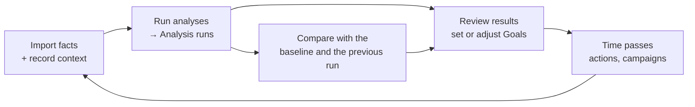
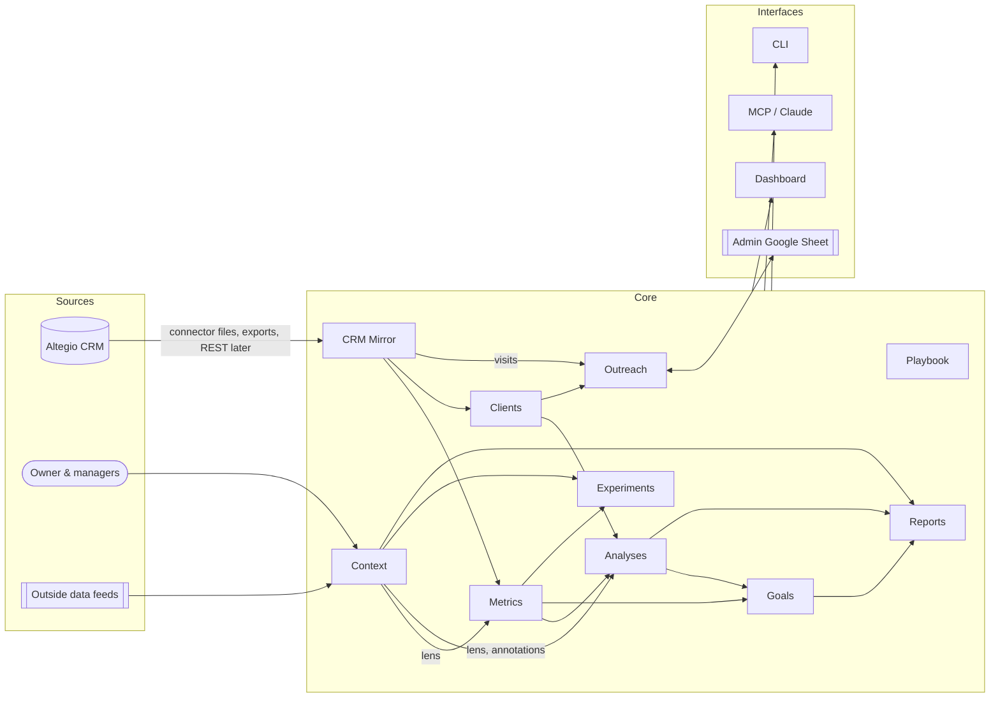

# barberis-insights — Architecture

> Living document. It describes the **target** architecture and how the current code maps onto it.
> Vocabulary lives in [`CONTEXT.md`](../CONTEXT.md). Decisions that are hard to reverse live in [`docs/adr/`](adr/).
> The roadmap and the process for changing this document are in [`PLAN.md`](PLAN.md).
> Status: **draft for review**. Sections marked *open question* are settled in the `grill-with-docs` session.

## 1. Purpose

A side tool for the **owner and managers** of a barbershop. It helps them run the business: understand performance, keep clients coming back, set and track goals, and decide what to change.

It works **next to** the CRM (Altegio), not instead of it. Staff keep working in Altegio; this tool reads from it, adds knowledge Altegio doesn't have, and turns both into decisions.

**The client is the main priority.** Most analysis questions come back to whether clients come, return, and stay.

## 2. Two sources of truth

| | **Facts** | **Context** |
|---|---|---|
| What | What happened: appointments, visits, schedules, clients, services, prices | Why it may have happened, and what was going on: decisions, outside events, beliefs about cause and effect |
| Source | Altegio CRM | The owner and managers; later, automated outside data feeds |
| Who may change it | Nobody locally. Altegio is the source of truth; the local copy is a mirror. | The owner and managers (and Claude on their behalf) |
| Examples | 42 visits for a barber in a week | A planned power outage cut Tuesday short. Prices rose on 19 March. Many regular clients are abroad in summer. A competitor opened nearby. |

Facts without Context lead to wrong conclusions. For example:
- a drop caused by power outages gets read as falling demand
- a price rise gets credit for a change that seasonality caused

So **every analysis declares which Context it took into account**, and Context can change the result in defined ways (§5.5).

The owner's beliefs are valuable but can be wrong. Each one can be turned into a **Hypothesis** and checked against the Facts. Context is respected, not blindly trusted.

## 3. The analysis cycle

The tool exists to run this loop, over and over, with code instead of ad-hoc chat analysis:



1. **Run:** every analysis runs on the data available, for a window, a scope and a lens. Each result is stored as an **Analysis run**, which is reproducible and versioned.
2. **Baseline:** the first run a goal is set against is its **Baseline**. The analysis of 27 September 2026 is the first baseline.
3. **Goals** are set on metrics that the analyses report.
4. **Compare:** a later run of the same analysis, scope and lens is **compared** with the baseline and with the previous run. The comparison says, metric by metric, whether things moved toward the goals, and Context explains why.

The two analyses first built by hand in chat — the per-barber weekly book and the team comparison — become the first analyses in code (§5.3), and their pages become reports rebuilt from stored runs (§5.4).

## 4. Principles

1. **Altegio is authoritative for facts.** Local data is a re-importable mirror. Local-only data (goals, factors, cases, analysis runs, notes) is the only thing that must be backed up.
2. **Context is first-class data**, with dates, scope and declared effects, not free text attached to charts.
3. **Analyses are code, and their results are data** (ADR-0007). One module per metric, and one module per analysis. Runs are stored and compared; nothing important lives only in a chat answer.
4. **Every number is reproducible.** A run or measurement records its window, the versions of its metric and analysis definitions, its lens, and a fingerprint of the data it saw.
5. **Modules own their data.** A module changes its own tables only. Others go through its service interface.
6. **Pure domain logic, thin edges.** Metrics and analyses are pure functions over loaded data, testable with fixtures. I/O (database, Altegio files, Google, web) sits at the edges.
7. **Local-first and private.** It runs on the owner's laptop. Personal data stays in `var/` and never goes to git. Only the data the admin needs reaches their sheet.
8. **Claude is a first-class user.** Every capability a person has in the dashboard is also exposed through the MCP server, with the same rules. Claude writes the narrative on top of stored runs, never instead of them.
9. **Extensible by registration.** New metrics, analyses, data sources, factor feeds and report sections plug in without changing existing modules.

## 5. Module map



Dependencies point **one way**, from left to right. Mirror and Context depend on nobody. Interfaces depend on modules and never the reverse.

| Module | Responsibility | Owns (tables) | Depends on | Code today |
|---|---|---|---|---|
| **CRM Mirror** | Import and keep a faithful local copy of Altegio facts; record every sync run | `barbers`, `appointments`, `appointment_services`, `schedule_slots`, `clients` (Altegio fields), `sync_runs` | — | `ingest/`, `db/` |
| **Context** | The owner's truth: factors (outside and internal), decisions, observations, and how each should affect analysis | `notes` (→ `factors`, §5.5) | — | `context/` |
| **Metrics** | One module per metric: its definition, scopes, direction and version; measurements | `measurements` | Mirror, Context | `metrics/` (all in `core.py` today) |
| **Analyses** | One module per analysis: a structured, versioned result for a window, scope and lens; stored runs; comparisons between runs | `analysis_runs` | Metrics, Clients, Context | not yet (logic lives in `legacy/`, `metrics/weekly.py`, `web/app.py`) |
| **Clients** | Client profiles, segments, value, risk | `client_profiles`, local client fields (`do_not_contact`) | Mirror | `clients/` |
| **Outreach** | Win-back cases, offers, the admin sheet, attribution of returns | `outreach_cases`, `outreach_events`, `offers` | Clients, Mirror (visits) | `outreach/` |
| **Goals** | Goals on metrics, with baseline, target, due date, and progress from measurements and runs | `goals`, `goal_events` | Metrics, Analyses | `goals/` |
| **Experiments** | Hypotheses and their evaluation (difference-in-differences, before/after, offer A/B), controlling for Context | `hypotheses` | Metrics, Context, Outreach | `experiments/` |
| **Playbook** | Shared routines and tips for barbers | `tips` | — | `playbook/` |
| **Reports** | Compose stored analysis runs, goals and Context into readable pages (barber book, team comparison, monthly review); export them | — (reads runs) | Analyses, Goals, Context | not yet (dashboard pages do parts) |
| **Interfaces** | Dashboard, JSON API, CLI, MCP server, scheduler | — | all modules (through services) | `web/`, `api/`, `cli.py`, `mcp_server.py` |

**Planned:**
- **Finance:** product sales, costs and payroll, once Altegio data allows.
- **Feeds:** adapters that create factors automatically (§5.5).

## 6. Modules in detail

### 6.1 CRM Mirror
- **Adapters** implement one contract: *give me canonical rows for a window* (`ingest/base.py`: `upsert_appointments`, `replace_schedule`, `sync_run`).
  - **Today:** files saved from the Altegio Pro connector (`connector_files.py`) and the Altegio client export, matched to client IDs by visit time (`client_export.py`, `client_match.py`).
  - **Later:** an Altegio REST adapter, once the partner token works (ADR-0002).
- **Rules:**
  - Idempotent upserts keyed by Altegio IDs; the newest copy wins.
  - Each import is a `sync_run` with counts and a log.
  - Nothing outside Mirror writes to Altegio-owned fields.
- **Known data gaps** are recorded as Context observations, not patched in code:
  - cancelled appointments are deleted in Altegio
  - no-show marking is manual
  - service payments are not recorded

### 6.2 Metrics — one module per metric
- **Layout:**
  ```
  metrics/
    registry.py          discovery + MetricDef (key, label, unit, direction, scopes, version)
    context.py           WindowContext: loaded facts, schedules and lens for one window
    capacity/            busy_share.py, busy_share_by_weekday.py, scheduled_hours.py
    revenue/             revenue.py, revenue_per_hour.py, average_check.py, revenue_per_workday.py
    volume/              visits.py, visits_per_week.py, visits_per_workday.py, booking_length.py
    clients/             unique_clients.py, new_to_shop.py, return_90d.py, overdue_regulars.py, revenue_concentration.py, usual_gap.py
    channels/            online_share.py, addon_share.py
  ```
- **Each metric module holds:**
  - one `@metric` definition: a pure function `(WindowContext, Scope) → value`
  - a docstring with the business definition
  - a `VERSION`
  - a fixture test in `tests/metrics/`
- **Scopes:** barber, team, shop, and later segment.
- **Measurements** are stored in long format (`asof`, window, scope, metric, metric version, lens, value), so a new metric needs no schema change.
- **Changing a definition** raises the metric's `VERSION`, and comparisons only compare equal versions. *Open question:* whether to re-run old windows automatically.
- **Regression:** the 2026-09-27 baseline is pinned by `tests/test_metrics_baseline.py`.

### 6.3 Analyses — one module per analysis
An **analysis** answers one business question for a window, scope and lens, with a structured result. It calls metrics and Clients; it never queries tables directly.

- **Contract** for each analysis module:
  ```python
  class Analysis(Protocol):
      key: str; version: int; scopes: set[str]
      def run(self, ctx: AnalysisContext) -> AnalysisResult: ...
      def compare(self, before: AnalysisResult, after: AnalysisResult) -> Comparison: ...
  ```
- **`AnalysisResult`** is plain JSON:
  - `kpis`: metric key → value
  - `series`: named time series
  - `tables`: named rows
  - `findings`: rule-based, each with severity and the evidence behind it
  - `context`: the factors in force during the window
- **The first analyses**, taken from the hand-built pages and earlier chat analyses:

| Analysis | Question it answers | Origin |
|---|---|---|
| `barber_scorecard` | How does each barber do on the key metrics, against last year and against the team? | team comparison scorecard |
| `weekly_book` | Week by week: revenue against last year, busy share, clients by type, ledger | Оля's weekly book |
| `weekday_pattern` | Which days and hours are full or empty, per barber? | weekday heat table, hour histogram |
| `price_demand` | Did price changes reduce visits per work day? | price vs demand chart |
| `client_retention` | Of last period's clients, how many stayed, switched to another barber, or were lost? | "where clients went" |
| `return_cohorts` | Of first-time clients by month, how many came back? | second-visit cohort table |
| `client_sources` | Where did a barber's clients come from (returning, other barbers, new to the shop)? | client sources table |
| `exclusive_clients` | How many regulars see only this barber (risk if they leave)? | exclusivity analysis |
| `departure_impact` | When a barber left, how many of their regulars stayed with the shop, and with whom? | Віталій analysis |
| `new_clients` | How many new clients per day and month, and what share of all clients? | new-clients analysis |
| `service_mix` | Which services and extras drive revenue? | service mix |
| `overdue_regulars` | Who is overdue, and how much are they worth? | at-risk analysis |

- **Analysis run** (`analysis_runs` table): analysis key and version, scope, window, lens, `asof`, data fingerprint (appointment count and last import), created by (person, schedule or Claude), and the result JSON. Runs are immutable; re-running creates a new run.
- **Comparison:** `compare(before, after)` gives each KPI's change and whether it is better or worse (using the metric's direction), plus what is new or resolved among the findings. Runs are only comparable when the analysis version, metric versions, scope and lens match; otherwise the comparison says why not.

### 6.4 Reports
- **What a report is:** a composition of analysis runs, goals and Context, for example:
  - *Barber book*: `barber_scorecard` + `weekly_book` + `weekday_pattern` + `client_retention` + `return_cohorts` + goals for one barber
  - *Team comparison*: `barber_scorecard` for all + `weekday_pattern` + `client_retention` + team goals
  - *Monthly review*: all of the above, compared with the previous run and the baseline
- **Where they appear:** reports render in the dashboard and export to HTML. Claude adds the narrative through MCP, citing run IDs.
- **They replace the two hand-built artifact pages.**

### 6.5 Context — the second source of truth
This module turns the owner's knowledge into data the analysis can act on.

**Factor** (target model; today's `notes` are its narrative-only predecessor):

| Field | Meaning |
|---|---|
| `kind` | `external` (not under our control: security, energy, economy, calendar, weather, competition, migration) or `internal` (our decision: price, staff, schedule, marketing, operations) |
| `period` | dates (and optionally hours) when it applies; can be recurring (e.g. summer, school holidays) |
| `scope` | shop, team, specific barbers, or a client segment |
| `expected_effects` | the owner's belief: which metrics, which direction, rough size, confidence |
| `treatment` | how analysis should handle it, see the table below |
| `source` | owner, manager, Claude, or a named feed |
| `status` | `belief` → `supported` / `refuted` / `inconclusive`, once a linked Hypothesis is evaluated |

**Treatments: how Context changes analysis**

| Treatment | Effect on analysis | Example |
|---|---|---|
| `annotate` | Shown on charts, timelines and reports; numbers unchanged | Competitor opened nearby |
| `exclude` | The period is removed from comparisons and baselines for that scope | Shop closed during a long power outage |
| `adjust` | The denominator or expectation is corrected (e.g. scheduled hours reduced by outage hours) | A 3-hour scheduled outage on a work day |
| `control` | Used as a covariate or a matching condition in Experiments | Season, holidays, air-raid-alert hours |

**Lens:** a named set of factor treatments applied to a computation, for example "raw", "clean weeks" or "outage-adjusted". Runs, measurements and hypothesis results store the lens they used, so two numbers are always comparable or visibly not.

**Feeds** *(planned):* adapters that create external factors automatically. Candidates:
- air-raid alert history for Lviv
- planned power-outage schedules
- public holidays and school calendar
- weather

Each feed is a plugin, like a Mirror adapter. *Open question:* which feeds are worth it; to be settled with the `research` skill.

**Belief ↔ evidence:** any factor with `expected_effects` can produce a Hypothesis in one click. Its verdict updates the factor's `status`.

### 6.6 Clients
- **Profiles** are derived from Mirror on every ingest: first and last visit, visits, spend, usual barber, usual gap.
- **Segments:** active, slipping, overdue, lapsed, one-time, switched. The rules are in `clients/risk.py`.
- **Priority** combines value, how recoverable the client is, and loyalty.
- **Local-only client data** (`do_not_contact`, Altegio comment) is owned here.
- *Open question:* how Context affects risk. For example, a client known to be abroad shouldn't count as overdue.

### 6.7 Outreach
- **Case lifecycle:** proposed → approved → in sheet → contacted outcomes → won back or not returned.
- **Approval:** a person approves every case before an admin sees it.
- **Admin interface:** a Google Sheet, through a service account (ADR-0004). The sync is idempotent; contacts are removed from the sheet when a case closes.
- **Attribution:** a case counts as won back when the client completes a visit within N days of contact. Offer A/B arms feed Experiments.

### 6.8 Goals
- **Shape:** a goal = scope + metric (and its version) + lens + baseline run or measurement + target + due date.
- **Progress** is the latest comparable value against the baseline. "On track" compares progress with time elapsed.
- **History:** each new analysis run updates every affected goal's history, so the owner sees the path, not only the latest point.

### 6.9 Experiments
- **Methods:** difference-in-differences (treatment barbers against control barbers), before/after, and offer A/B, with bootstrap or z-test intervals.
- **Planned:** control for Context factors, and generate hypotheses from factors.

### 6.10 Interfaces
- **Dashboard:** FastAPI with server-rendered pages, bound to `127.0.0.1`. Cross-site writes are blocked.
- **JSON API** at `/api/*`.
- **CLI:** `insights …`, including `insights analyze` and `insights compare` (planned).
- **MCP server:** for Claude.
- **Rule:** interfaces call module services and never query another module's tables directly. Today `web/app.py` does in places; that's a refactor target.
- **Scheduler** *(planned):* launchd jobs for sync → analyze → compare → sheet sync, once a REST source exists.

## 7. Cross-cutting

| Concern | Rule |
|---|---|
| **Time** | Weeks are ISO weeks (Monday start) in the shop's local time. A window is whole weeks. A run or measurement is "as of" the last day of its window. |
| **Scopes** | `shop`, `team` (the barbers tracked), barber keys, and later client segments. They are used the same way across all modules. |
| **Versioning** | Metrics and analyses carry a `VERSION`. Stored values record it. Only equal versions are compared. |
| **Privacy** | Personal data is limited to name, phone and email. It lives only in `var/insights.sqlite` and the admin sheet. Analysis results hold IDs and aggregates, never contact details. The repo is public, so business data stays in `var/` and `legacy/`. |
| **Idempotency** | Every import and sync can be re-run safely. Analysis runs are immutable; re-running creates a new run. |
| **Audit** | Changes to goals, cases and factors keep an event trail. Runs record who or what created them. |
| **Testing** | Each metric and each analysis has its own fixture test. Behaviour on real data is checked by regression tests that skip when data isn't present. |
| **Migrations** | Alembic. Non-model objects (FTS5) are excluded from autogenerate. |
| **Config** | `INSIGHTS_*` environment variables or `.env`. Private seed data: `var/barbers.json`, `var/seed_notes.json`. |

## 8. Extension points

| To add… | Do this | Touches |
|---|---|---|
| a metric | a new module under `metrics/<family>/` with `@metric`, `VERSION` and a fixture test | Metrics only |
| an analysis | a new module under `analyses/` implementing `run` and `compare`, plus a fixture test | Analyses only |
| a report | compose existing analyses in `reports/` | Reports only |
| a data source | an adapter writing through `ingest/base.py` | Mirror only |
| a factor feed | a feed adapter producing factors | Context only |
| a lens | a named treatment set in Context | Context, used by Metrics and Analyses |
| a page or MCP tool | call module services; no direct table access | Interfaces only |

## 9. Current state vs target

| Area | Today | Target |
|---|---|---|
| Metrics layout | all metrics (17 keys) in one `metrics/core.py` | one module per metric, versioned, each with its own test |
| Analyses | done by hand in chat or in one-off scripts (`legacy/`); partly in `metrics/weekly.py` and dashboard handlers | `analyses/` modules with `run` and `compare`, stored `analysis_runs` |
| Baseline / comparison | one stored measurement (2026-09-27); goals compare with the latest measurement | baseline and previous runs compared per analysis; goal history from runs |
| Reports | two hand-built claude.ai artifact pages; dashboard pages | reports composed from stored runs, in the dashboard and exported to HTML |
| Owner context | `notes`: free text with dates, scopes and tags | `factors` with effects, treatments, lenses and belief status |
| Analysis lens | none (raw facts) | every run, measurement and hypothesis records its lens |
| Module boundaries | services take a database session and read any table; `web/app.py` queries tables | each module exposes a service; cross-module reads go through it |
| Altegio access | connector files plus a manual export | plus a REST adapter and a scheduler (blocked on the partner token) |

## 10. Change process
This document changes **with** the code, never after it:
- **New or renamed concept:** update `CONTEXT.md`.
- **Hard-to-reverse decision:** add an ADR in `docs/adr/` and link it here.
- **New module or a change in dependencies:** update §5 and §9 in the same pull request.

See [`PLAN.md`](PLAN.md) for the skills that drive each step.
